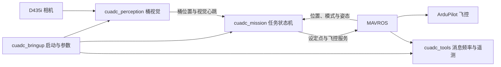

# 包职责与通信接口

本版按职责拆分原包的构建和安装边界。任务内部的导航、投放、状态检查仍在原 C++ 节点中，以保留原飞机的任务行为。

| 包 | 构建类型 | 主要内容 |
| --- | --- | --- |
| `cuadc_mission` | `ament_cmake` | 单个 C++ 状态机及其原有导航、跟踪、投放逻辑 |
| `cuadc_perception` | `ament_python` | 原视觉适配器、分析模块、地面预览和三个模型 |
| `cuadc_tools` | `ament_python` | 独立 GPS 航向标定、MAVLink 发送频率设置、CSV 遥测 |
| `cuadc_bringup` | `ament_python` | 全任务启动、原 YAML 参数和标定航向加载 |

参考项目含独立载荷、安全、飞控适配、自定义接口等包；原压缩包采用单节点内部实现。本版没有为对应这些目录而创建空包，也没有改变载荷控制的调用链。

## 桶视觉接口

默认话题为 `/perception/drop_buckets_body`，消息类型为 `geometry_msgs/msg/PoseArray`。字段沿用原包：

| 字段 | 含义 |
| --- | --- |
| `header.stamp` | 图像采集返回后的 ROS 时间戳，记录在深度对齐和推理之前 |
| `header.frame_id` | 默认 `fcu_body_frd` |
| `position.x/y/z` | 桶中心的机体 FRD 坐标，单位为米 |
| `orientation.x` | 桶直径，单位为米 |
| `orientation.y` | 检测置信度 |
| `orientation.z/w` | 桶口中心的机体 FRD X/Y 坐标，单位为米 |

这里的 `orientation` 承载自定义标量，不能作为姿态四元数解释。无有效目标时仍发布空数组，作为视觉心跳。

## 坐标系

飞控机体 FRD 的轴向为前、右、下；任务内部 FLU 为前、左、上。MAVROS 位置与设定点使用 ENU。场地航向以正北为 0°、顺时针增加，转换为 ENU 偏航角时采用 `yaw_enu = 90° - heading_deg`。

## 实际进程

正常 launch 创建 MAVROS、发送频率配置、遥测记录、桶视觉和任务节点。发送频率配置工具完成请求后退出；任务节点退出时触发 launch 关闭。相机由视觉代码直接读取，因此本版未启动额外的 RealSense ROS 图像节点。
