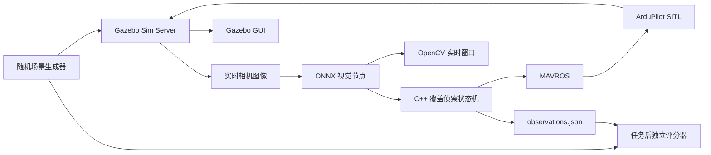

# CUADC Hazard Recognition Simulation

面向 CUADC 危险物侦察任务的独立开源仿真包。项目基于 ROS 2、Gazebo Sim、ArduPilot SITL、MAVROS 和 ONNX Runtime，实现未知桶位条件下的区域覆盖搜索、RTK 坐标转换、实时视觉识别与 C++ 飞行状态机。

> 本仓库只包含危险物侦察仿真，不包含物资运输、投放或救援全流程。


## 功能特点

- 未知桶位搜索：状态机只读取公开识别区域，不读取随机桶坐标。
- 区域完整覆盖：默认在 5 × 8 m 区域生成 7 条往复式航带、14 个覆盖端点。
- 随机场景：每个 seed 随机生成桶位置、危险物类别、标牌朝向、尺度与中心偏移。
- 真实视觉接入：ONNX 模型直接处理实时 ROS 图像，输出检测框、10 类置信度和标注图像。
- 主动视觉确认：发现候选目标后投影目标位置、短距离居中并累计类别证据。
- RTK 坐标链：WGS84 → ECEF → RTK 基站 ENU → MAVROS 本地 ENU。
- 双可视化：Gazebo GUI 和 OpenCV 实时识别窗口默认同时打开。
- 真值隔离：随机目标真值不会进入状态机，只在任务完成后由独立评分器读取。

## 系统结构



仿真默认使用 Gazebo 相机图像生成与载机位置对齐的实时 ROI，再交给与实机相同的 ONNX 节点。视觉节点消费标准 `sensor_msgs/Image`；接入机载 D435i 时只需替换图像话题并重新标定相机参数。

## 仓库结构

```text
cuadc_hazard_recognition_sim/
├── src/recon_state_machine_cpp.cpp      C++ 覆盖侦察状态机
├── scripts/hazard_vision_node.py        ONNX 推理与 OpenCV 窗口
├── scripts/generate_scene.py            随机场景生成
├── scripts/evaluate_coverage_result.py  任务后独立评分
├── scripts/run_hazard_coverage_once.sh  一键完整仿真
├── launch/hazard_recognition.launch.py  Gazebo/ROS 2 启动文件
├── config/                              场景、相机与 RTK 配置
├── models/                              Gazebo 模型及标识纹理
├── worlds/                              Gazebo 世界
├── examples/seed_4104/                  精简复现实验结果
└── docs/SIM_TO_REAL_WORKFLOW.md          实机迁移说明
```

## 已验证环境

- Ubuntu 22.04
- ROS 2 Humble
- Gazebo Sim 8.13.0
- ArduPilot Copter SITL 和 ardupilot_gazebo
- MAVROS
- Python 3、OpenCV、NumPy、ONNX Runtime
- C++17、yaml-cpp

Gazebo Sim 和 ArduPilot 插件版本必须相互兼容。当前完整测试使用 `ArduPilotPlugin` 和 JSON SITL 后端。

## 安装

### 1. 系统依赖

```bash
sudo apt update
sudo apt install -y \
  ros-humble-desktop \
  ros-humble-mavros ros-humble-mavros-extras \
  ros-humble-ros-gz-bridge ros-humble-cv-bridge \
  python3-opencv python3-numpy python3-pip python3-yaml \
  libyaml-cpp-dev
python3 -m pip install --user -r requirements.txt
```

还需要预先安装并构建 ArduPilot、ardupilot_gazebo 和对应的 Gazebo Sim。默认路径分别为 `~/ardupilot` 和 `~/ardupilot_gazebo`，也可设置：

```bash
export ARDUPILOT_DIR=/path/to/ardupilot
export ARDUPILOT_GAZEBO_DIR=/path/to/ardupilot_gazebo
```

### 2. 放入 ROS 2 工作区

```bash
mkdir -p ~/cuadc_ws/src
cd ~/cuadc_ws/src
git clone <YOUR_GITHUB_REPOSITORY_URL> cuadc_hazard_recognition_sim

cd ~/cuadc_ws
source /opt/ros/humble/setup.bash
rosdep install --from-paths src --ignore-src -r -y
colcon build --symlink-install --packages-select cuadc_hazard_recognition_sim
source install/setup.bash
```

### 3. 配置视觉模型

ONNX 权重不包含在仓库中。请设置：

```bash
export CUADC_HAZARD_MODEL=/absolute/path/to/dangerous_target.onnx
```

模型输出类别顺序必须与 `scripts/hazard_vision_node.py` 中的 `CLASS_NAMES` 一致。模型缺失时一键脚本会在启动前报错。

## 运行

默认同时打开 Gazebo 和 OpenCV 窗口：

```bash
cd ~/cuadc_ws
export CUADC_HAZARD_MODEL=/absolute/path/to/dangerous_target.onnx
bash src/cuadc_hazard_recognition_sim/scripts/run_hazard_coverage_once.sh 4104
```

更换最后一个数字即可生成新的随机桶位和类别。无人值守回归：

```bash
CUADC_SHOW_GAZEBO_GUI=false \
CUADC_SHOW_VISION_WINDOW=false \
bash src/cuadc_hazard_recognition_sim/scripts/run_hazard_coverage_once.sh 5201
```

完整的路径覆盖方式：

```bash
CUADC_WS=$HOME/cuadc_ws \
ARDUPILOT_DIR=$HOME/ardupilot \
ARDUPILOT_GAZEBO_DIR=$HOME/ardupilot_gazebo \
CUADC_HAZARD_MODEL=$HOME/models/dangerous_target.onnx \
bash src/cuadc_hazard_recognition_sim/scripts/run_hazard_coverage_once.sh 5201
```

## 输出

每次运行保存在 `~/cuadc_ws/cuadc_outputs/hazard_runs/seed_<seed>/`：

- `observations.json`：状态机原始输出，包含 `state_machine_has_ground_truth=false`。
- `result.json`：任务结束后的独立评分结果。
- `mission.log`：RTK、覆盖航线、视觉居中和状态转换。
- `vision.log`：ONNX 推理与 OpenCV 窗口日志。
- `generated_scene.yaml`：本次随机场景和评分真值。
- `frames/`：按间隔保存的原始及标注图像。

`examples/seed_4104` 保存精简通过样例，不包含大体积日志。

## 覆盖航线

| 参数 | 默认值 | 说明 |
|---|---:|---|
| 区域尺寸 | 5 × 8 m | 公开侦察区域 |
| 飞行高度 | 1.5 m | MAVROS 本地相对高度 |
| 航带间距 | 0.70 m | 小于相机横向覆盖 |
| 航带数 | 7 | 往复式排列 |
| 覆盖端点 | 14 | 每条航带两个端点 |
| 端点接受半径 | 0.30 m | 三维到达判定 |
| 相机地面覆盖 | 1.02 × 1.80 m | 当前等效值 |
| 视觉居中超时 | 5 s | 超时后恢复覆盖 |
| 类别证据窗口 | 3 s | 居中后累计 |

起飞点到首个覆盖端点是进场段。只有实际到达首端点后才启用识别记账，避免区域外纹理形成误报。

## RTK 与坐标变换

工程区分 `gazebo_world_enu`、`rtk_base_enu` 和 MAVROS `map_enu`。有效 `NavSatFix` 进入状态机后执行：

```text
WGS84 geodetic -> ECEF -> RTK base ENU
-> horizontal yaw alignment -> MAVROS local ENU
```

RTK 负责水平对齐；飞行高度始终使用 MAVROS 本地 Z，避免混淆椭球高、海拔高、天线杆高和飞控本地原点。

实机部署前必须测量基站坐标及天线高、识别区域相对基站的位置与朝向、相机外参和 RTK/MAVROS 水平偏航差。详见 [实机迁移说明](docs/SIM_TO_REAL_WORKFLOW.md)。

## 真值隔离

`generated_scene.yaml` 包含公开区域和仿真评分真值，但 C++ 状态机只解析识别区域、RTK 基站和载机初始参考，明确不读取 `recon_targets`。评分器只在任务生成 `observations.json` 后读取真值并空间匹配。

## 仿真结果

| seed | 覆盖 | 分类 | 空桶误报 | 结果 |
|---:|---:|---:|---:|---|
| 4102 | 14/14 | 5/5 | 0 | 通过 |
| 4103 | 14/14 | 4/5 | 0 | 有毒品/自燃物品边界混淆 |
| 4104 | 14/14 | 5/5 | 0 | 通过 |

seed 4104 的三个目标定位误差为 0.071–0.160 m。seed 4103 中全部目标位置均找到，剩余错误属于 ONNX 类别边界，没有通过类别特例或读取真值修正。

## 已知限制

- ONNX 权重由使用者提供，仓库不能保证不同模型的精度。
- 默认 ROI 相机适配器用于稳定复现；真实机载相机需要重新标定投影参数。
- 默认 RTK 基站坐标是 ArduPilot SITL 测试坐标，实机必须替换。
- 当前只验证单机、单实例端口 9012。
- 纹理和 Iris 网格有独立来源说明。

## 开发验证

```bash
source /opt/ros/humble/setup.bash
colcon build --packages-select cuadc_hazard_recognition_sim
python3 -m py_compile scripts/*.py launch/*.py
bash -n scripts/*.sh
```

贡献说明见 [CONTRIBUTING.md](CONTRIBUTING.md)。

## 许可证

原创代码以 [GNU LGPL v3.0 only](LICENSE) 发布。第三方网格和竞赛标识纹理不自动适用代码许可证，参见 [THIRD_PARTY_NOTICES.md](THIRD_PARTY_NOTICES.md)。

当前归档：`v0.2.0`，2026-07-17。
