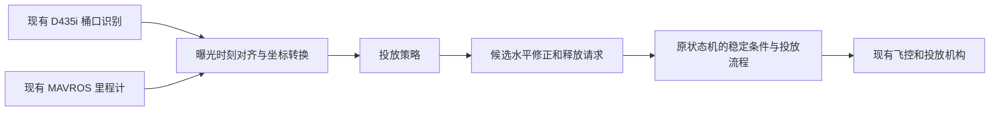

# CUADC 投放阶段强化学习方案草案

这是一套针对 [Accelerate11/2026CUADC](https://github.com/Accelerate11/2026CUADC) 的**本地、可运行研究草案**。目标是利用现有 D435i 视觉和飞控里程计，在接近桶口后学习投放时机，并逐步研究小幅水平修正。**不增加传感器**。搜索、选桶、起降、航线、姿态控制仍由原任务状态机和飞控负责。

用户目前给出的约束是“投放阶段采用强化学习、不增加传感器”；具体算法与动作范围尚未限定。因此这里把第一版限定为**近悬停、单个已锁定桶、单瓶投放**，先建立能复现的试验，再决定是否扩大动作范围。

## 先运行

基础部分只需 **Python 3.10+**，不需要 ROS、Gazebo、GPU 或任何第三方包。已在 Windows 的 Python 3.14 和 3.12 上验证；Ubuntu 可以把命令中的 `python` 换成 `python3`。

在本文件所在目录打开终端：

```bash
python scripts/run_quickstart.py
```

此命令依次运行测试、36 组弹道计算、6000 回合 Q-learning、两套各 300 场的对比评估、两份 HTML 回放及遥测接口示例。所有生成文件保存在 `outputs/`。双击 `outputs/demo_q.html` 即可播放；拖动时间轴可查看释放位置与最终落点。

也可以先只看一场基线投放：

```bash
python scripts/demo.py --policy hover --seed 2026 --out outputs/demo_hover.html
```

交付目录的 `examples/results/` 保存了本次真实运行的模型、评估和回放快照，不需要先训练即可阅读。原始工作目录还保留 `outputs/`。默认种子 2026 的 Q-learning 回放是一场擦边未命中的案例，方便观察失败原因，没有筛选成只展示成功。

## 方案具体做什么



目录中的实际硬件接口目前止于**影子决策**：输入已有观测、输出候选决策及理由。图中后半段是接入设计，尚未写入原状态机。不会连接飞控或发出舵机命令。

| 实现 | 学习的动作 | 用途 |
|---|---|---|
| Q-learning，已实现 | 等待 / 请求投放 | 最小闭环；不依赖深度学习框架 |
| PPO，已实现可选入口 | 两维限幅速度残差 + 请求投放 | 在原对准控制基础上研究微调 |
| 悬停基线 | 对准后低速稳定，再投放 | 判断 RL 是否有实际收益 |
| 弹道基线 | 按速度、高度与标称延迟预测落点 | 判断学习是否优于简单模型 |

这里的“基线”是本目录自行实现的简化控制器，并非原项目实飞算法的复制。Q-learning 的二维移动由固定对准控制器完成，**学习的只有投放时机**；PPO 才会学习水平微调。算法、观测及奖励详见 [方案说明](docs/01_方案设计.md)。

## 与你现有项目的对应关系

2026-09-05 通过 GitHub 当前目录接口核对到：

- `code/2026code/状态机/cuadc_full_mission_node_3_v2_public .cpp`：注意 `public` 后有空格；包含 `ALIGN`、`RELEASE`，订阅 `/mavros/local_position/odom` 与 `/perception/drop_buckets_body`。
- `code/2026code/视觉/视觉2.0/drop/basket_detect_seg.py`：使用 D435i、YOLO 分割、桶口椭圆及深度。该脚本本身主要录像和打印，**不能直接假设它已经发布状态机需要的 ROS 话题**。
- `sim/cuadc_sim/`：Gazebo/ArduPilot/ROS 2 仿真。虚拟裁判按飞机当前位置评分，尚未计算瓶子的真实下落轨迹。本草案补充轻量弹道试验，但没有修改该仿真包。

参考的 [状态机公开文件](https://github.com/Accelerate11/2026CUADC/blob/main/code/2026code/%E7%8A%B6%E6%80%81%E6%9C%BA/cuadc_full_mission_node_3_v2_public%20.cpp) 明确省略了实机外参、弹道参数、同步和正式门限。这些内容无法从公开仓库推断，本草案中的相关数值都是**可修改的演示假设**。[来源与核对记录](docs/05_来源与边界.md) 列出了具体文件和 blob SHA。

## 仿真范围与参数

默认桶口直径 **25 cm**；另有 15 cm、20 cm 配置，来自仓库 [场景配置](https://github.com/Accelerate11/2026CUADC/blob/main/sim/cuadc_sim/config/scene.yaml)，不是对最新比赛规则的独立确认。

默认假设瓶体有效半径 3 cm、余量 0.5 cm，所以有效命中半径为 `12.5 - 3 - 0.5 = 9 cm`。默认高度 `1.2 m` 是**投放口到桶口平面的垂直高度**，不能直接使用起飞相对高度替代。

| 配置文件 | 场景 |
|---|---|
| `configs/nominal.json` | 无风、机构参数固定；保留观测噪声 |
| `configs/randomized.json` | 默认域随机化：风、延迟、观测误差、深度噪声 |
| `configs/stress.json` | 更大风、噪声、视觉延迟和丢帧 |
| `configs/vision_loss.json` | 全程视觉失效，应超时而不释放 |
| `configs/bucket_15cm.json` / `bucket_20cm.json` | 仓库较小桶口尺寸 |
| `configs/warmup_large_bucket.json` | 50 cm 教学桶，仅用于热身，不对应仓库桶尺寸 |

配置文件采用 JSON，只覆盖列出的字段，其余取 `drop_rl/config.py` 默认值。每次训练、评估会保存完整展开配置。

模拟了飞机水平一阶速度响应、载荷继承速度、机构延迟、水平线性空气阻力、视觉曝光延迟和丢帧。**未模拟六自由度、翻滚、下洗、撞沿弹跳、落桶后滞留、目标误识别和全场航线**。命中表示瓶体截面在首次穿越桶口平面时落入有效半径，不等价于实物成功留桶。详见 [仿真说明](docs/02_仿真与参数.md)。

## 分步训练与评估

```bash
python scripts/ballistic_sweep.py
python scripts/train_q.py --config configs/randomized.json --episodes 6000 --seed 11 --out outputs/q_policy.json
python scripts/evaluate.py --model outputs/q_policy.json --episodes 300 --seed 80000000 --out outputs/evaluation
python scripts/evaluate.py --model outputs/q_policy.json --config configs/stress.json --episodes 300 --seed 81000000 --out outputs/stress
python scripts/evaluate.py --model outputs/q_policy.json --config configs/bucket_15cm.json --episodes 300 --seed 83000000 --out outputs/bucket15
python scripts/demo.py --policy q --model outputs/q_policy.json --seed 2026 --out outputs/demo_q.html
python scripts/demo.py --policy q --config configs/vision_loss.json --out outputs/vision_loss.html
```

小桶评估示例刻意使用同一个 25 cm 训练模型，属于尺寸外推试验。要为小桶单独训练，将 `train_q.py` 的 `--config` 换成对应文件并另存模型。

评估使用相同种子为四种策略生成相同初始条件与外部扰动，所有策略只能读取 `Observation`。`info` 和回放中的落点真值只用于评分。命中率分母包含超时与越界；平均落点误差只统计已释放回合，因此同时报告释放率、超时、P90 和 95% Wilson 区间。

本次默认场景 300 场实测：悬停基线 **92.7%**，Q-learning **83.7%**，弹道基线 **66.3%**，随机策略 **16.3%**。这证明代码完成训练评估闭环，**尚不能证明 RL 优于悬停规则**。压力场景仍明显退化，详见 [运行结果](docs/04_实验结果.md)。

## 可选 PPO

建议 Python 3.10–3.12，单独虚拟环境。PPO 不影响基础版本。

Windows PowerShell：

```powershell
py -3.12 -m venv .venv-ppo
.\.venv-ppo\Scripts\python.exe -m pip install -r requirements-ppo.txt
.\.venv-ppo\Scripts\python.exe scripts/train_ppo.py --steps 200000 --out outputs/ppo_policy
.\.venv-ppo\Scripts\python.exe scripts/evaluate_ppo.py --model outputs/ppo_policy.zip --episodes 300
```

Ubuntu：

```bash
python3 -m venv .venv-ppo
.venv-ppo/bin/python -m pip install -r requirements-ppo.txt
.venv-ppo/bin/python scripts/train_ppo.py --steps 200000 --out outputs/ppo_policy
.venv-ppo/bin/python scripts/evaluate_ppo.py --model outputs/ppo_policy.zip --episodes 300
```

`train_ppo.py` 会先运行 SB3 环境检查，再保存模型、训练监控与版本元数据。输出的三个数依次为水平速度残差 x、y 和释放请求；残差范数上限默认为 0.15 m/s，总水平指令范数上限为 0.6 m/s。高度固定，由原任务控制维持。

本次已实际验证约 3 万步 PPO 训练和独立评估；具体依赖版本记录在 `requirements-ppo-tested.txt`，可用它代替范围依赖文件复现此环境。

评估时需显式传入与训练一致的 `--config`；省略表示默认配置。`evaluate_ppo.py` 同时运行两个基线，物理指标可直接比较；PPO 训练额外包含残差动作代价，训练回报与评估基础回报不要混为一谈。

## 接回项目的步骤

1. 标定现有相机到机体、投放口到机体的外参，用已有视频和日志估计延迟、深度误差和响应时间。
2. 在原状态机中对已有视觉与里程计做时间同步、坐标转换和目标身份锁定；输出本目录约定的快照。
3. 先运行 `integration/replay_telemetry.py` 或可选 ROS 2 影子节点，只比较候选决策和原策略。
4. 将候选水平修正与投放请求接入原 `ALIGN/RELEASE`，由原状态机保持唯一控制输出与舵机执行责任。
5. 经过 Gazebo/SITL、机构台架及受控低速投放，对同样测试条件比较误差与成功率；没有可靠优势就继续保留原规则。

[接入说明与字段表](integration/README.md) 提供坐标、时间、数据字段、状态转换和缺失信息处理细节。所需数据全部来自已有视觉、飞控和程序状态；没有增加风速计、外部定位系统、落点传感器或释放检测传感器。

## 文件夹结构

```text
cuadc_drop_rl/
├── README.md
├── configs/                    # 可覆盖的仿真配置
├── docs/                       # 方案、模型、落地、结果、来源
├── drop_rl/
│   ├── config.py               # 参数与校验
│   ├── physics.py              # 下落与水平运动
│   ├── observation.py          # 策略可见观测、门控、固定对准控制
│   ├── env.py                  # 二维投放仿真
│   ├── policies.py             # 基线与 Q-learning
│   ├── gym_env.py              # PPO 环境
│   ├── integration.py          # 坐标转换与单次候选请求
│   └── replay*.{py,html}       # 离线可视化
├── scripts/                    # 运行、训练、评估、回放、归档
├── integration/                # 遥测回放和可选 ROS 2 影子节点
├── examples/
│   ├── telemetry.jsonl         # 已有传感器数据接口示例
│   └── results/                # 本次运行的可复查快照
├── tests/                      # 标准库 unittest；可选 Gym 检查
├── requirements.txt            # 基础版本无第三方依赖
├── requirements-ppo.txt        # 可选依赖范围
└── outputs/                    # 本机生成结果，不纳入常规版本管理
```

## 常见问题

- **是否能直接飞？** 现在可以直接运行仿真、训练和日志回放；接入实机需要你的标定、时间同步、状态机整合与验证。本目录没有实机执行入口。
- **缺少深度怎么办？** 使观测无效，暂停释放并交回原状态机处理；不以仿真真值补齐，也不要求新增测距器。
- **没有测风能补偿风吗？** 可从现有运动历史研究间接估计，但飞机表现不能唯一确定瓶子受风。当前策略没有风输入，无法保证强风或突发风下精确补偿。
- **只有相机图像就够吗？** 本草案沿用仓库现有 RGB-D 和飞控估计；不训练端到端图像网络，视觉识别沿用现有代码。
- **PPO 缺包？** 使用其单独虚拟环境并安装 `requirements-ppo.txt`；基础命令不需要安装。
- **为什么没有完整克隆原仓库？** 这里只交付新增方案文件夹，并记录核对过的来源；没有修改或推送 GitHub。
